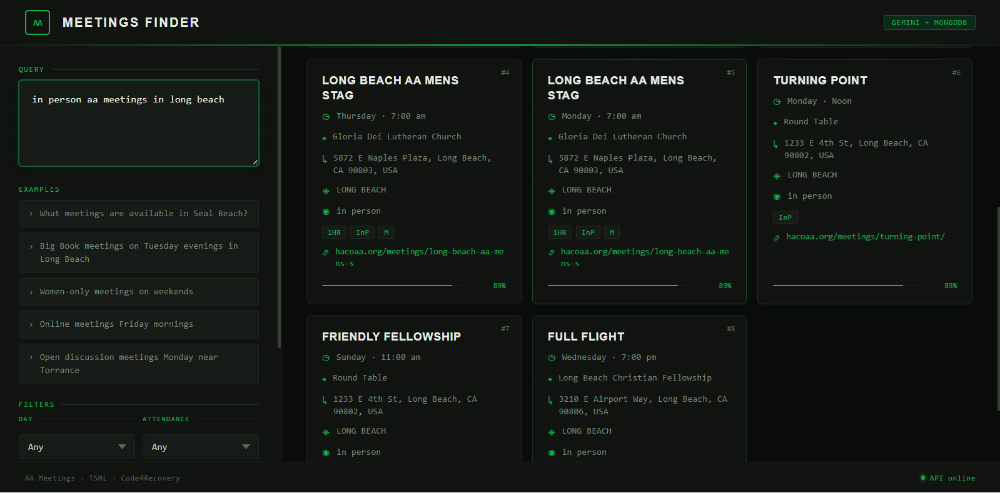

# ai-meeting-api-query
Python3 app able to utilize AI for Generrative 12 Step Conversational Summaries, and API queries to produce json output & meeting query results to get query requests of keyword, lat, lon, and radius.  

## Requires
* Linux webserver
* Python3
* Gemini API Key
* Google Maps API Key
* meetings.json or national-meetings.json
* python dependencies: numpy as np flask  Flask, request, jsonify, send_from_directory flask_cors CORS json re os math time traceback google genai

## Features
* from json meeting input it can respond to get query parameters, and produce TSML json output limited to the scope of the geolocation & keyword & radius query.

## QuickStart
1. replace DOMAIN with live domain in ensure_running.sh 
2. replace KEY with Google Maps API Key in frontend/index.html
3. create .env file with Gemini API Key
4. or, run API Server, Configure aa-ai-meeting-finder-chat.html for Meeting Results

## Background:
* https://www.longbeachaa.org/matthew-l-naatw-ai-in-aa-new-depth-to-meeting-list-a/

## Examples:
* https://ragpg.matthews.help/ui
* https://ai.lovethecode.cloud:5007/?q=renegades&lat=33.7799&lon=-118.328&radius=12
* https://ai.lovethecode.cloud:5012/api/ask?q=meeting&lat=33.7799&lon=-118.328&radius=12

## Other Prototypes to Demonstrate Features

### A. Python3 API Server/MongoDB TSML JSON/Gemini AI/Nginx Integrated Meeting Finder
* HTML5/CSS3/JavaScript client file (aa-ai-meeting-finder-chat.html) accesses API for Interactive Queries of Meetings.
* RAG from VectorStorage is utiized for Faster AI Query responses in updated Python3 API, To Be Released.



### B. JSON Schema Spec for AI Meeting Data Processing and Validation
```
{
  "$schema": "https://json-schema.org/draft/2020-12/schema",
  "title": "Meeting Schema Object",
  "description": "A comprehensive schema for validating a collection of tsml json formatted meetings.",
  "type": "array",
  "items": {
    "type": "object",
    "required": [
      "name",
      "slug",
      "day",
      "time",
      "location",
      "address",
      "city",
      "state",
      "postal_code",
      "country",
      "latitude",
      "longitude"
    ],
    "properties": {
      "name": {
        "type": "string",
        "description": "Official name of the meeting."
      },
      "slug": {
        "type": "string",
        "pattern": "^[a-z0-9-]+$",
        "description": "URL-friendly version of the name (lowercase, no spaces)."
      },
      "day": {
        "type": "integer",
        "minimum": 0,
        "maximum": 6,
        "description": "0=Sunday, 1=Monday, 2=Tuesday, 3=Wednesday, 4=Thursday, 5=Friday, 6=Saturday"
      },
      "time": {
        "type": "string",
        "pattern": "^([01]\\d|2[0-3]):([0-5]\\d)$",
        "description": "24-hour start time HH:MM (e.g., 18:00)"
      },
      "end_time": {
        "type": "string",
        "pattern": "^([01]\\d|2[0-3]):([0-5]\\d)$",
        "description": "24-hour end time HH:MM."
      },
      "conference_url": {
        "type": "string",
        "format": "uri",
        "description": "The link for online meetings (e.g., Zoom, Google Meet)."
      },
      "conference_phone": {
        "type": "string",
        "pattern": "^\\+?\\d{10,15}$",
        "description": "Dial-in phone number for the meeting, digits only."
      },
      "conference_url_notes": {
        "type": "string",
        "description": "Passwords, Meeting IDs, or specific login instructions."
      },
      "latitude": {
        "type": "number",
        "minimum": -90,
        "maximum": 90,
        "description": "WGS84 Latitude."
      },
      "longitude": {
        "type": "number",
        "minimum": -180,
        "maximum": 180,
        "description": "WGS84 Longitude."
      },
      "location": {
        "type": "string",
        "description": "Name of the venue (e.g., Alano Club)."
      },
      "group": {
        "type": "string",
        "description": "The name of the hosting group."
      },
      "notes": {
        "type": ["string", "null"],
        "description": "Specific directions or entry instructions."
      },
      "updated": {
        "type": "string",
        "pattern": "^\\d{4}-\\d{2}-\\d{2} \\d{2}:\\d{2}:\\d{2}$",
        "description": "Timestamp formatted as YYYY-MM-DD HH:MM:SS."
      },
      "url": {
        "type": "string",
        "format": "uri"
      },
      "types": {
        "type": "array",
        "items": {
          "type": "string",
          "enum": ["O", "C", "T", "D", "LGBTQ", "W", "M", "B", "SP", "ST", "TR", "X", "MED"],
          "description": "O=Open, C=Closed, T=Step, D=Discussion, LGBTQ=LGBTQ+, W=Women, M=Men, B=Big Book, SP=Speaker, ST=Step Study, TR=Tradition, X=Wheelchair Access, MED=Meditation"
        }
      },
      "address": { "type": "string" },
      "city": { "type": "string" },
      "state": { 
        "type": "string", 
        "minLength": 2, 
        "maxLength": 2,
        "description": "2-character state code (e.g., CA)."
      },
      "postal_code": { 
        "type": "string", 
        "pattern": "^\\d{5}(-\\d{4})?$",
        "description": "US Zip code or Zip+4."
      },
      "country": { 
        "type": "string", 
        "default": "US" 
      },
      "approximate": { 
        "type": "string", 
        "enum": ["yes", "no"] 
      },
      "entity": { "type": "string" },
      "entity_email": { "type": "string", "format": "email" },
      "entity_location": { "type": "string" },
      "entity_logo": { "type": "string", "format": "uri" },
      "entity_phone": { "type": "string" },
      "entity_url": { "type": "string", "format": "uri" },
      "feedback_emails": {
        "type": "array",
        "items": { "type": "string", "format": "email" }
      }
    }
  }
}
```
